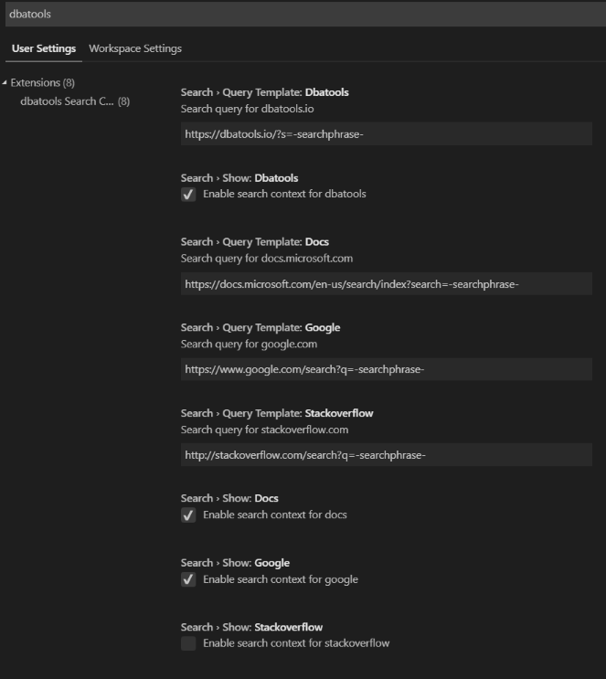

# dbatools search for vs code

Search right from your code: dbatools, microsoft docs, google and more.

## Features

By default, this extension allows you to search dbatools.io, microsoft docs or google for the highlighted text. The results are displayed in the default browser.

## Configuration

Other search providers (currently just StackOverflow) are also available but disabled by default. To enable, update your settings. Here's how to do it with the GUI.

File -> Preferences -> Settings -> type dbatools

## Issues
If you run into any problems, please log an issue on [GitHub](https://github.com/potatoqualitee/vscode-dbatools-search/issues).