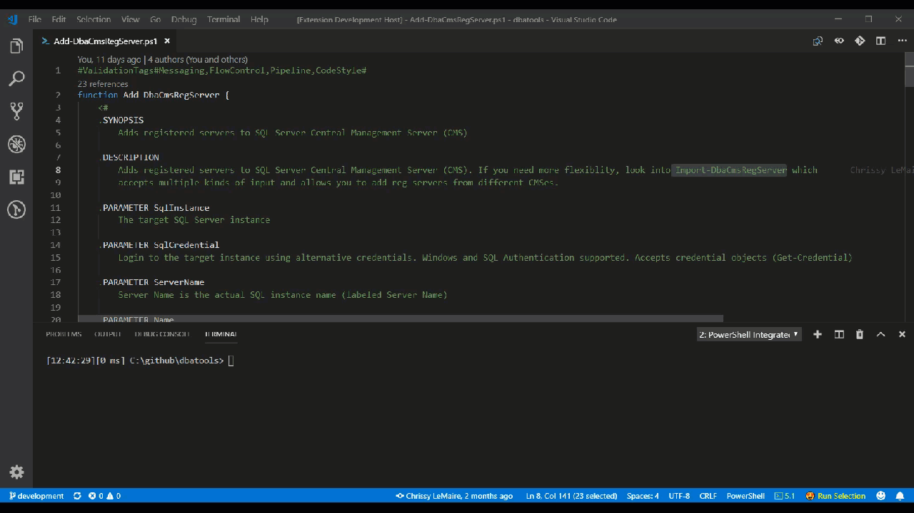

# dbatools search for vs code

 Perform a web search on dbatools.io and docs.dbatools.io of selected text using a handy context menu entry.

## Features

This dbatools extension allows you to search dbatools.io and docs.dbatools.io for the highlighted text. The results are displayed in the default browser.

## Configuration

If you run into any problems, please log an issue on [GitHub](https://github.com/potatoqualitee/vscode-dbatoolsdocs/issues).

